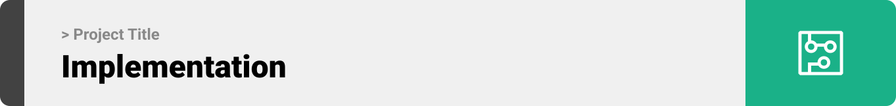
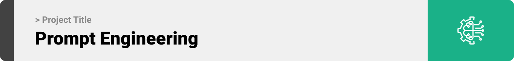

<br><br>

<!-- project philosophy -->


> A web app for requesting any home medical service, so that people living alone or those who need continuous medical care can get treated well at home with 24/7 service.
>
> Elder people living alone find it hard sometimes to take good care of the their medical issues, or even people with chronic cases who need continuous medical care face a lot of issues. This project aims to help these people secure all kind of medical services (private nurses,medical supplies, medical consulation, lab samples, etc..) around the clock while they're at home.

### User Stories

- As a patient, I want to have a live chat with a medical admin to get help with specific services/medical opinions, so that I can benefit the most from the application.
- As a patient, I want to request medical services, so that I can get the needed care at home.
- As a patient, I want to get a brief quick analysis of my results, so that I can know if I should do something or contact someone urgently.
- As a staff, I want to get email with my schedule so that I don't miss any schedule task.
- As a staff, I want to have access over my patients' profiles, so that I can provide good care.
- As an admin, I want to have full access over the system, so that I can provide good management of human and medical resources.
- As an admin, I want to assign staff to newly received requests.
- As an admin, I want to have live chat with any patient, so that I can give any urgent comment and for better communication securing high quality of service.

<br><br>

<!-- Tech stack -->


### Medicare is built using the following technologies:

- This project uses the React.js framework for building a dynamic and responsive frontend. React.js is a powerful JavaScript library for creating user interfaces, allowing us to build reusable UI components for web applications.
- The backend services are developed using Laravel, a robust PHP framework that provides a rich set of features for building modern web applications securely and efficiently.
- AI analysis of medical images is powered by Flask, a lightweight Python web framework that integrates machine learning models to provide accurate diagnostics.

<br><br>

<!-- UI UX -->


> We designed Medicare using wireframes and mockups, iterating on the design until we reached the ideal layout for easy navigation and a seamless user experience.

- Project Figma design [figma](https://www.figma.com/design/g6qblgpjeJHnLPb3eqQ4LB/Untitled?node-id=129-180&t=QndoqJuSN1t2Hus4-0)

### Mockups

| Home screen                             | Menu Screen                           | Order Screen                          |
| --------------------------------------- | ------------------------------------- | ------------------------------------- |
|  |  |  |

<br><br>

<!-- Database Design -->


### Architecting Data Excellence: Innovative Database Design Strategies:

- 

<br><br>

<!-- Implementation -->


### User Screens (Mobile)

| Login screen                              | Register screen                         | Landing screen                          | Loading screen                          |
| ----------------------------------------- | --------------------------------------- | --------------------------------------- | --------------------------------------- |
|  |  |  |  |
| Home screen                               | Menu Screen                             | Order Screen                            | Checkout Screen                         |
|  |  |  |  |

### Admin Screens (Web)

| Login screen                            | Register screen                       | Landing screen                        |
| --------------------------------------- | ------------------------------------- | ------------------------------------- |
|  |  |  |
| Home screen                             | Menu Screen                           | Order Screen                          |
|  |  |  |

<br><br>

<!-- Prompt Engineering -->


### Mastering AI Interaction: Unveiling the Power of Prompt Engineering:

- This project uses advanced prompt engineering techniques to optimize the interaction with natural language processing models. By skillfully crafting input instructions, we tailor the behavior of the models to achieve precise and efficient language understanding and generation for various tasks and preferences.

<br><br>

<!-- AWS Deployment -->


### Efficient AI Deployment: Unleashing the Potential with AWS Integration:

- This project leverages AWS deployment strategies to seamlessly integrate and deploy natural language processing models. With a focus on scalability, reliability, and performance, we ensure that AI applications powered by these models deliver robust and responsive solutions for diverse use cases.

<br><br>

<!-- Unit Testing -->


### Precision in Development: Harnessing the Power of Unit Testing:

- This project employs rigorous unit testing methodologies to ensure the reliability and accuracy of code components. By systematically evaluating individual units of the software, we guarantee a robust foundation, identifying and addressing potential issues early in the development process.

<br><br>

<!-- How to run -->


> To set up Coffee Express locally, follow these steps:

### Prerequisites

This is an example of how to list things you need to use the software and how to install them.

- npm
  ```sh
  npm install npm@latest -g
  ```

### Installation

_Below is an example of how you can instruct your audience on installing and setting up your app. This template doesn't rely on any external dependencies or services._

1.  Get a free API Key at [example](https://example.com)
2.  Clone the repo
    git clone [github](https://github.com/MahdiMk-dev/medicare)
3.  For Frontend applications (user and admin):
    a. Install NPM packages
    ```sh
    npm install
    ```
          b. Start running the App
    ```sh
    npm start
    ```
4.  For backend part:
    a. For Laravel APIs:
    ```sh
    php artisan serve
    ```
          b. For flask app (AI analysis)
    ```sh
    flask run
    ```

Now, you should be able to run Medicare locally and explore its features.
